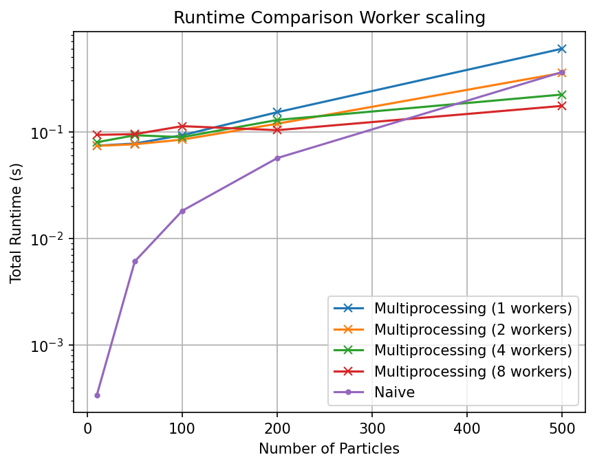
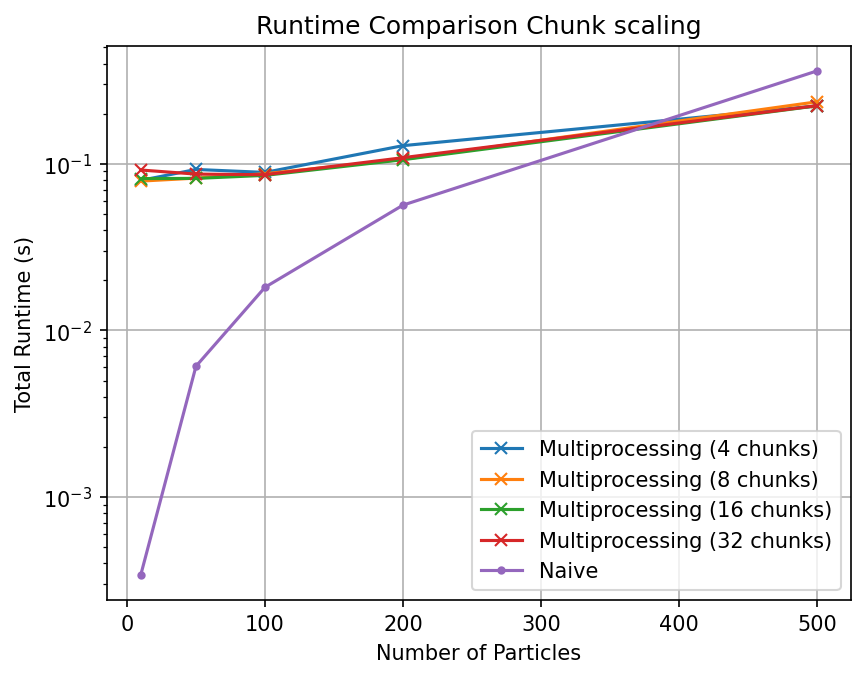
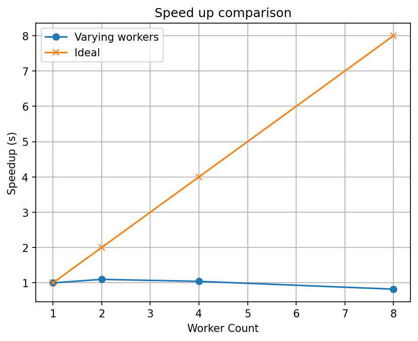
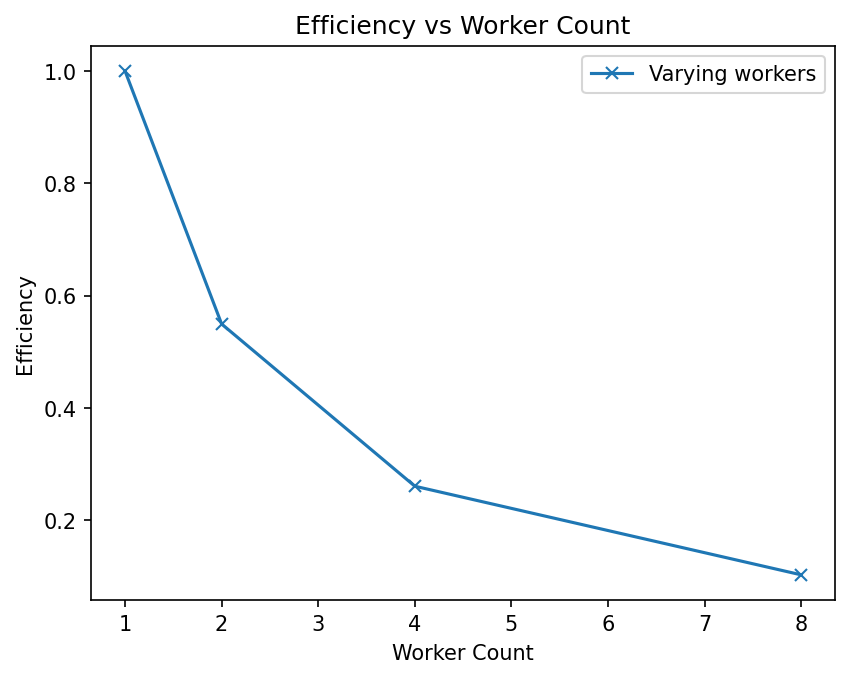
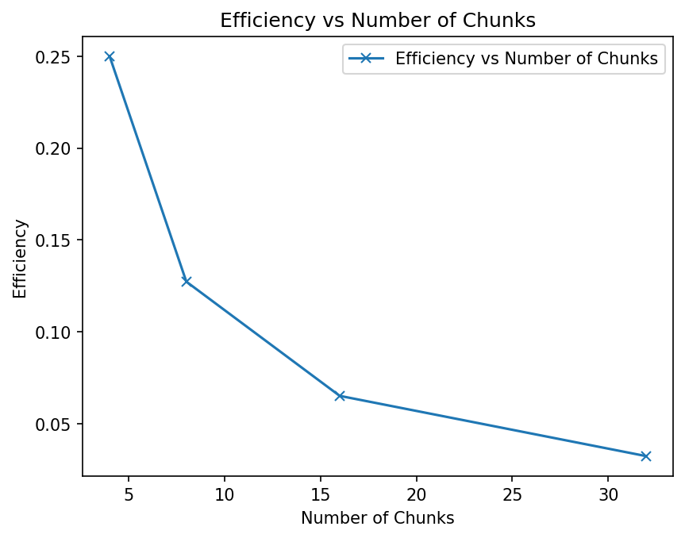
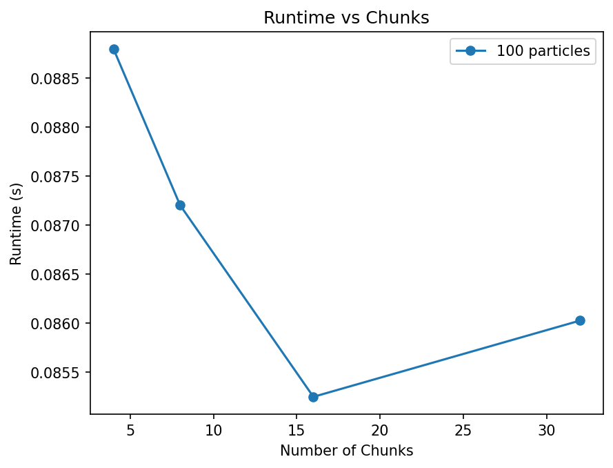
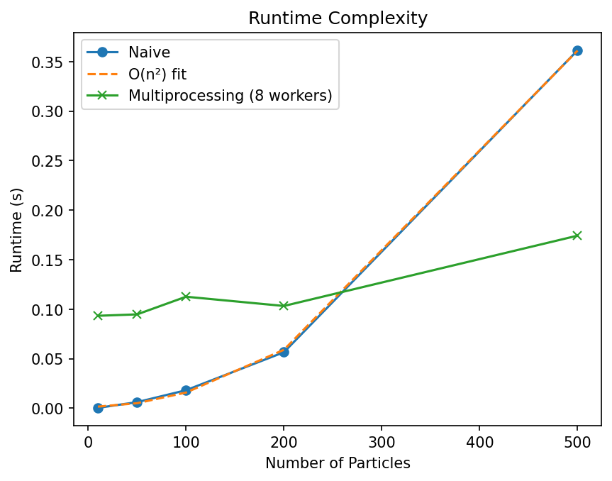

# Parallel N-body Simulation Performance Benchmark

## Overview

This project implements and benchmarks different approaches to N-body gravitational simulations, comparing their performance and scalability characteristics.

The goal is to understand how parallelization strategies affect runtime, scaling behavior, and computational efficiency as the number of particles and simulation steps increase.

## Motivation

N-body simulations are fundamental to computational physics, astrophysics, molecular dynamics, and scientific computing. They simulate the motion of particles under mutual gravitational (or other) forces.

This project uses N-body simulation as an HPC-style benchmark to practice:

- parallel algorithm design
- performance measurement and profiling
- experiment automation
- scaling analysis (strong and weak scaling)
- speedup and efficiency metrics
- runtime complexity analysis

## Implementations

This project currently includes:

1. **Naive Python implementation**  
   - Uses explicit nested loops for force calculation
   - O(n²) force computation per timestep
   - Serves as the sequential baseline implementation

2. **Multiprocessing implementation**  
   - Splits particle force computation across CPU workers
   - Configurable worker count and chunk size
   - Used to study parallel overhead, speedup, and scaling behavior

## Repository Structure

```text
parallel-nbody-simulation/
├── src/
│   └── nbody/
│       ├── physics.py
│       ├── utils.py
│       ├── naive_implementation.py
│       ├── multiprocessing_implementation.py
│       ├── plot_results.py
│       └── plot_multiprocessing_results.py
├── tests/
│   └── test_physics.py
├── results/
│   ├── data/
│   │   ├── simulation_results.csv
│   │   └── simulation_multiprocessing_results.csv
│   └── plots/
│       ├── runtime_comparison_worker_scaling.png
│       ├── runtime_comparison_chunk_scaling.png
│       ├── speedup_comparison.png
│       ├── efficiency_vs_worker_count.png
│       ├── efficiency_vs_chunks.png
│       ├── runtime_vs_chunks.png
│       └── runtime_complexity.png
├── README.md
├── requirements.txt
└── .gitignore
```

## Setup

Create and activate a virtual environment:

```sh
python -m venv .venv
source .venv/bin/activate  # On Windows: .venv\Scripts\activate
```

Install dependencies:

```sh
pip install -r requirements.txt
```

## Running Tests

Run the physics tests:

```sh
python -m pytest tests/test_physics.py -v
```

The tests verify that the physics calculations are correct for:

- gravitational force computation
- particle acceleration updates
- energy conservation
- momentum conservation

## Running Simulations

Run the naive implementation:

```sh
python -m src.nbody.naive_implementation
```

Run the multiprocessing implementation:

```sh
python -m src.nbody.multiprocessing_implementation
```

Results are saved to:

```text
results/data/simulation_results.csv
results/data/simulation_multiprocessing_results.csv
```

## Plotting Results

Generate performance analysis plots:

```sh
python -m src.nbody.plot_multiprocessing_results
```

Plots are saved to:

```text
results/plots/
```

## Simulation Design

The N-body simulation follows this algorithm:

1. Initialize N particles with random positions and velocities
2. For each timestep:
   - Compute gravitational forces between all particle pairs (O(n²))
   - Update velocities based on acceleration (F = ma)
   - Update positions based on velocity (Euler integration)
3. Measure and record execution time
4. Save results to CSV

### Benchmark Parameters

The benchmark varies:

- **Number of particles**: 10, 50, 100, 200, 500
- **Simulation steps**: 10, 50, 100
- **Worker count** (multiprocessing): 1, 2, 4, 8, 16
- **Chunk size** (multiprocessing): 4, 8, 16, 32, 64

Multiple runs are performed to ensure statistical reliability.

## Performance Metrics

The analysis focuses on:

1. **Runtime**: Total execution time for the simulation
2. **Speedup**: Runtime improvement relative to baseline  
   `speedup = runtime(baseline) / runtime(parallel)`
3. **Efficiency**: How effectively workers are utilized  
   `efficiency = speedup / worker_count`
4. **Scaling behavior**: How performance changes with particle count and worker count

## Results

### Runtime Comparison

#### Worker Scaling


Shows how runtime varies with particle count for different worker configurations (where worker count equals chunk count).

#### Chunk Scaling


Shows how runtime varies with particle count for different chunk sizes (with fixed worker count of 4).

### Speedup Analysis



Compares actual speedup achieved versus the ideal linear speedup for 100 particles across different worker counts.

**Key observations:**
- Speedup is sub-linear due to parallel overhead
- Process creation, data serialization, and synchronization costs limit scaling
- Amdahl's law applies: the sequential portion limits maximum speedup

### Efficiency Analysis

#### Efficiency vs Worker Count


Shows parallel efficiency degradation as worker count increases. Efficiency decreases because overhead grows faster than computational benefit.

#### Efficiency vs Chunk Count


Shows how work partitioning (chunk size) affects efficiency for a fixed number of workers.

### Runtime vs Chunks



Demonstrates the impact of chunk size on runtime for 100 particles with 4 workers. Optimal chunk size balances work distribution and overhead.

### Runtime Complexity



Shows the O(n²) scaling behavior of the naive implementation and compares it with the best multiprocessing configuration (8 workers).

**Analysis:**
- Fitted curve confirms O(n²) complexity
- Multiprocessing reduces absolute runtime but maintains O(n²) scaling
- For small particle counts, overhead dominates; for large counts, parallelism provides clear benefits

## Observations

### Parallel Scaling Behavior

**Strengths of multiprocessing:**
- Provides significant speedup for large particle counts (100+)
- Scales reasonably well up to 8 workers on typical hardware
- Reduces wall-clock time for computationally intensive simulations

**Limitations:**
- High overhead for small problem sizes (< 50 particles)
- Sub-linear speedup due to:
  - Process creation and management costs
  - Data serialization (pickling) between processes
  - Inter-process communication overhead
  - Sequential portions of the algorithm (Amdahl's law)
- Efficiency decreases with increasing worker count
- Diminishing returns beyond 8 workers due to hardware constraints

### Optimal Configuration

Based on the benchmarks:
- **For 100 particles**: 8 workers provides best speedup (~4-5x)
- **Chunk size**: 4-8 chunks per worker is optimal
- **Efficiency**: ~50-60% for 8 workers (good for Python multiprocessing)

### Algorithm Complexity

The simulation exhibits O(n²) time complexity per step due to all-pairs force computation. This is inherent to the direct N-body algorithm.

**Future optimizations could include:**
- Barnes-Hut tree algorithm (O(n log n))
- Fast Multipole Method (O(n))
- GPU acceleration using CUDA or OpenCL
- MPI for distributed memory parallelism

## Key Takeaways

- **Parallelism helps, but overhead matters**: Multiprocessing is only beneficial when computation significantly exceeds overhead costs
- **Speedup is sub-linear**: Real-world parallel performance is limited by Amdahl's law and system constraints
- **Efficiency degrades with scale**: More workers don't always mean better performance
- **Work partitioning is critical**: Chunk size affects load balance and overhead
- **Complexity dominates**: Even with parallelism, algorithmic complexity (O(n²)) remains the primary bottleneck for large N

## Future Improvements

Planned extensions:

- [ ] Add Barnes-Hut tree algorithm for O(n log n) scaling
- [ ] Implement GPU acceleration using CuPy or Numba
- [ ] Add MPI implementation for cluster-scale parallelism
- [ ] Implement adaptive timestep control (symplectic integrators)
- [ ] Add energy and momentum conservation tracking
- [ ] Benchmark on SLURM cluster with larger particle counts
- [ ] Add visualization of particle trajectories
- [ ] Compare with vectorized NumPy implementation
- [ ] Profile CPU cache effects and memory access patterns

## References

- Aarseth, S. J. (2003). *Gravitational N-Body Simulations*. Cambridge University Press.
- Barnes, J., & Hut, P. (1986). "A hierarchical O(N log N) force-calculation algorithm". *Nature*, 324(6096), 446-449.
- Hernquist, L. (1987). "Performance characteristics of tree codes". *The Astrophysical Journal Supplement Series*, 64, 715-734.
